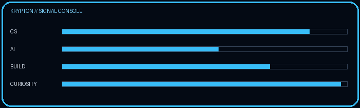
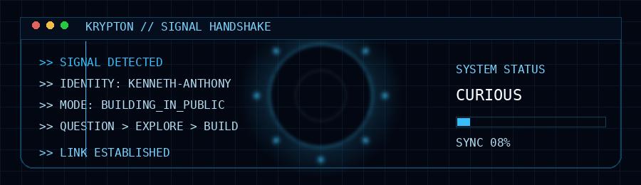
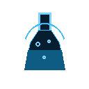

<p align="center">

  

</p>

<p align="center">

  

</p>

<p align="center">

  

</p>

<p align="center">

  

</p>

<p align="center">
  
  <b>Building from Nigeria</b>
  &nbsp;•&nbsp;
  
  <b>Computer Science</b>
  &nbsp;•&nbsp;
  
  <b>AI Engineering</b>
  &nbsp;•&nbsp;
  
  <b>Music</b>
</p>

<p align="center">
  
  <b>Building in public</b>
  &nbsp;•&nbsp;
  
  <b>Learning by building</b>
</p>


---

## `> KRYPTON_HANDSHAKE`

```text
┌──────────────────────────────────────────────────────────────────┐
│ KRYPTON // HANDSHAKE PROTOCOL                                   │
├──────────────────────────────────────────────────────────────────┤
│                                                                  │
│  [01] SIGNAL................. DETECTED                           │
│  [02] IDENTITY............... VERIFIED                           │
│  [03] CURIOSITY.............. ACTIVE                             │
│  [04] FOUNDATIONS............ ONLINE                             │
│  [05] ENGINEERING............ INITIALIZING                      │
│  [06] AI..................... EXPLORING                          │
│  [07] BUILD SYSTEM........... ARMED                              │
│                                                                  │
│  ┌────────────────────────────────────────────────────────────┐  │
│  │                                                            │  │
│  │        THIS PROFILE IS NOT A RESUME.                      │  │
│  │        IT IS A RECORD OF BECOMING.                        │  │
│  │                                                            │  │
│  └────────────────────────────────────────────────────────────┘  │
│                                                                  │
│                     CONNECTION ESTABLISHED                      │
└──────────────────────────────────────────────────────────────────┘
```

> **Entering the system means entering the process.**

---

## `> WHOAMI`

> **I'm not trying to look like an engineer. I'm trying to become one.**

I'm a student from **Nigeria 🇳🇬** exploring **Computer Science, software engineering, artificial intelligence, mathematics, and creative technology**.

This GitHub is a public engineering journal:

**what I learn → what I build → what breaks → what I discover → how I improve**

I don't want to merely learn how to use technology.

> **I want to understand it well enough to build with it.**

---

## `> SYSTEM_BOOT`

```text
┌─────────────────────────────────────────────────────────────┐
│ KRYPTON // PROFILE CORE                                    │
├─────────────────────────────────────────────────────────────┤
│ IDENTITY        Kenneth-Anthony Nwosu                       │
│ ORIGIN          Nigeria                                    │
│ STATE           LEARNING / BUILDING                         │
│ PRIMARY DOMAIN  COMPUTER SCIENCE                            │
│ DIRECTION       AI ENGINEERING                              │
│ MODE            BUILD IN PUBLIC                            │
│ PRINCIPLE       UNDERSTAND → BUILD → TEST → IMPROVE        │
└─────────────────────────────────────────────────────────────┘
```

<p align="center">

  

</p>

---

## `> THE_MISSION`

```text
                         CURIOSITY
                             │
                             ▼
                    ┌─────────────────┐
                    │   UNDERSTAND    │
                    │   THE FUNDAMENTS│
                    └────────┬────────┘
                             │
                             ▼
                    ┌─────────────────┐
                    │      BUILD      │
                    └────────┬────────┘
                             │
                             ▼
                    ┌─────────────────┐
                    │      BREAK      │
                    └────────┬────────┘
                             │
                             ▼
                    ┌─────────────────┐
                    │      DEBUG      │
                    └────────┬────────┘
                             │
                             ▼
                    ┌─────────────────┐
                    │   UNDERSTAND    │
                    └────────┬────────┘
                             │
                             └──────────────► BETTER QUESTIONS
```

> **Understand deeply. Build honestly. Improve relentlessly.**

---

## `> CURRENT_STATE`

| Domain                                                                           | Focus                                                 |
| -------------------------------------------------------------------------------- | ----------------------------------------------------- |
|  **Computer Science** | Algorithms · problem solving · computational thinking |
| 🐍 **Python**                                                                    | Programming foundations · data · automation           |
| 🌐 **Web**                                                                       | HTML · CSS · JavaScript                               |
| 🛠️ **Engineering**                                                              | Git · GitHub · testing · software design              |
| 📐 **Mathematics**                                                               | Foundations for computing                             |
|  **AI**                 | Exploring intelligent systems and AI engineering      |
| 🎹 **Music**                                                                     | Piano · creativity · expression                       |

<p align="center">

  
  
  
  
  

</p>

> **Foundations before hype.**

---

## `> MILESTONE // CS50P`

```text
┌─────────────────────────────────────────────────────────────┐
│ HARVARD CS50P // COMPLETED                                │
├─────────────────────────────────────────────────────────────┤
│                                                           │
│  09 PROBLEM SETS                                         │
│  + 01 FINAL PROJECT                                      │
│  + PYTHON                                                 │
│  + TESTING                                                │
│  + FILES / DATA / FUNCTIONS / DEBUGGING                   │
│                                                           │
│  STATUS: COMPLETE ✓                                      │
│                                                           │
└─────────────────────────────────────────────────────────────┘
```

**CS50's Introduction to Programming with Python — completed.**

The course taught me far more than Python syntax.

It changed how I approach problems:

**decompose → reason → implement → test → debug → understand**

### Final Project

## 🚀 AcadTranspiler

> **A Python tool that compiles university curriculum data into structured, validated, and analyzable information.**

The project grew from one question:

> **Can university curriculum information be made understandable to software?**

```text
CURRICULUM
     │
     ▼
   PARSE
     │
     ▼
 STRUCTURE
     │
     ▼
 VALIDATE
     │
     ▼
 ANALYSE
     │
 ┌───┴───────────────┐
 ▼                   ▼
REPORT               JSON
```

**[View AcadTranspiler →](https://github.com/kennethnwosua202311/AcadTranspiler)**
**[Watch the demo →](https://youtu.be/hiVFjDAsCY4)**

---

## `> FEATURED_BUILD`

###  AcadTranspiler

**STATUS:** `CS50P COMPLETE // PUBLIC // V1`

A small curriculum compiler built from a strange but simple question:

> **What if a university curriculum could be treated more like source code?**

AcadTranspiler reads structured curriculum information, validates it, models prerequisite relationships, analyses dependencies, and produces useful output.

```text
Human-readable academic information
                │
                ▼
          ACADTRANSPILER
                │
       ┌────────┼────────┐
       ▼        ▼        ▼
     PARSE   VALIDATE  ANALYSE
       │        │        │
       └────────┼────────┘
                ▼
        REPORT + JSON
```

The repository also documents the limitations of the current implementation and the directions in which the idea could evolve.

> **Small project. Bigger question.**

---

## `> PROJECT_TELEMETRY`

```text
╭──────────────────────────────────────────────────────╮
│ ACADTRANSPILER // RELEASE TELEMETRY                 │
├──────────────────────────────────────────────────────┤
│ STATUS       ████████████████████  COMPLETE          │
│ PARSING      ████████████████████  ONLINE            │
│ VALIDATION   ████████████████████  ONLINE            │
│ ANALYSIS     ███████████████░░░░░  PROTOTYPE         │
│ TESTING      ███████████████░░░░░  ACTIVE            │
│ DOCUMENTING  ████████████████████  COMPLETE          │
├──────────────────────────────────────────────────────┤
│ RELEASE: V1 // CS50P FINAL PROJECT                   │
│ NEXT:    V2 // DEEPER ENGINEERING                    │
╰──────────────────────────────────────────────────────╯
```

*These are project-state indicators, not fake skill percentages.*

---

## `> THINKING_ENGINE`

```text
QUESTION
   │
   ▼
EXPLORE
   │
   ▼
EXPERIMENT
   │
   ▼
BUILD
   │
   ▼
BREAK
   │
   ▼
DEBUG
   │
   ▼
UNDERSTAND
   │
   └──────────────────────► QUESTION AGAIN
```

> **A problem isn't only something to defeat. It is also a source of information.**

---

## `> AI_PROTOCOL`

I use AI extensively for learning, writing, brainstorming, coding, experimentation, and engineering.

But the relationship I want is:

```text
              AI
               │
               ▼
             ASSIST
               │
               ▼
            QUESTION
               │
               ▼
             VERIFY
               │
               ▼
              TEST
               │
               ▼
           UNDERSTAND
               │
               ▼
             OWN IT
```

> **AI can accelerate the work. Understanding has to become mine.**

I don't want AI to become a substitute for thought.

I want it to become a force multiplier for thought.

The goal isn't:

> **“Can AI produce this?”**

The better question is:

> **“Can I understand, test, modify, explain, and improve what was produced?”**

---

<details>

<summary><b>🔬 HOW I LEARN</b></summary>

```text
Learn
  ↓
Question
  ↓
Experiment
  ↓
Build
  ↓
Break
  ↓
Debug
  ↓
Understand
  ↓
Document
  ↓
Repeat
```

I care about the difference between **output** and **understanding**.

A finished artifact matters.

But the person who can explain it, modify it, debug it, and learn from it matters more.

</details>

---

## `> TRAJECTORY`

### NOW — `FOUNDATIONS`

`Python` · `JavaScript` · `Web Development` · `Computer Science` · `Git/GitHub` · `Mathematics`

↓

### NEXT — `ENGINEERING`

`Algorithms` · `Data Structures` · `Databases` · `Testing` · `Software Engineering` · `System Design`

↓

### LATER — `INTELLIGENT SYSTEMS`

`Machine Learning` · `Neural Networks` · `AI Engineering` · `Agents` · `Applied Research` · `Original Systems`

↓

### DESTINATION — `UNKNOWN`

The roadmap can change.

**The curiosity stays.**

---

## `> WHAT_I'M_REALLY_INTERESTED_IN`

> **How can software and intelligent systems be engineered to solve difficult, useful problems?**

```text
Computer Science
       +
Software Engineering
       +
Mathematics
       +
Artificial Intelligence
       │
       ▼
┌──────────────────────┐
│  INTELLIGENT SYSTEMS │
└──────────────────────┘
```

I'm especially interested in the engineering underneath the hype:

**algorithms · data · systems · models · architecture · reliability · reasoning**

---

## `> LEARNING_LAB`

<details>

<summary><b>🧪 Open the laboratory</b></summary>

This account is not meant to contain only polished work.

It is also a laboratory.

**Experiments** — technical questions turned into code.
**Practice** — exercises used to strengthen reasoning.
**Notes** — concepts that became clearer after implementation.
**Failures** — approaches that didn't work and what they taught me.
**Projects** — ideas that survive beyond the tutorial stage.

> **I care more about understanding than collecting certificates.**

</details>

---

## `> CODE × MUSIC × CURIOSITY`

Technology isn't the only thing that shapes how I think.

I also spend time with **music and piano**.

```text
STRUCTURE
   +
CREATIVITY
   +
ITERATION
   =
EXPRESSION
```

You create something.

You listen.

You notice what is wrong.

You change it.

You try again.

That mindset follows me into code.

---

## `> BUILT_FROM_NIGERIA`


### 🇳🇬 Nigeria

I'm interested in building at a global standard while starting exactly where I am.

I don't think geography should determine how seriously someone is allowed to think, learn, experiment, or build.

This profile is one public record of that process.

> **Built from Nigeria. Thinking globally. Learning in public.**

---

## `> PROGRESS`

I deliberately removed follower counts and third-party **Top Languages / GitHub-stat cards** from the core design.

Why?

Because a profile shouldn't ask:

> **“How impressive are my numbers?”**

before answering:

> **“What have I actually built?”**

Your real GitHub contribution graph and repositories already provide the evidence.

The README's job is to provide the **context**.

---

## `> PRINCIPLES`

```text
01  Learn the fundamentals.
02  Ask better questions.
03  Build things that force understanding.
04  Use tools without outsourcing judgment.
05  Test what you think you know.
06  Document what you discover.
07  Prefer substance over appearance.
08  Stay curious when the answer isn't obvious.
09  Let difficult problems change how you think.
10  Keep building.
```

---

## `> FUTURE_MODULES`

```text
[✓] curiosity
[✓] foundations
[✓] first experiments
[✓] CS50P
[✓] first public project
[~] deeper engineering
[ ] larger systems
[ ] machine learning
[ ] intelligent systems
[ ] research
[?] whatever comes after
```

**`?` is intentional.**

The future should contain discoveries I cannot predict from where I am now.

---

## `> FINAL_SIGNAL`

<p align="center">

  
  
  
  

</p>

<p align="center">

  

</p>

<p align="center">

  

</p>

<p align="center">
  <b>— Kenneth-Anthony Nwosu</b>
</p>
